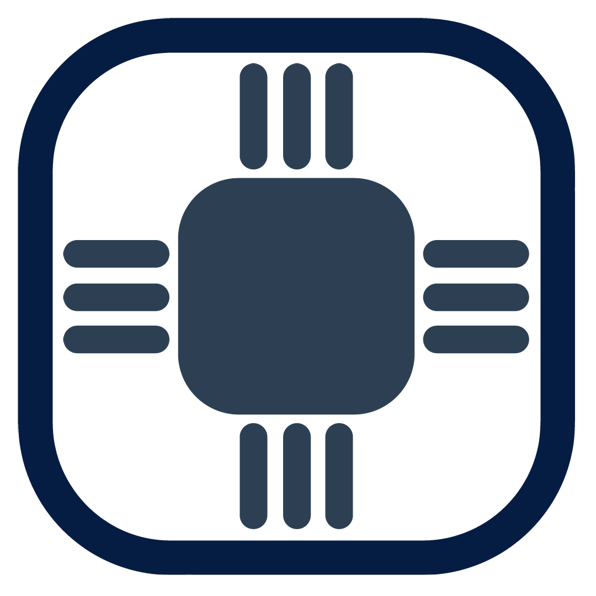

# Welcome To The Onyx Bash Project
<br>
<br>

<br>
### This is The Onyx Bash Project! My name is Edvard Busck-Nielsen, But you can call me Buscedv, And I'm a developer at Tell Space and Responsible for The Onyx Bash Project, Love to hear from you soon! <a href="https://github.com/Buscedv" target="blank"> My Github Page </a> && <a href="http://tellspace.ml" target="blank"> Tell Space's Website </a>
<br>
<br>
<br>

## Contributers:
<br>

Are you looking for a great starter open source Project? Then this is a great place for you! The Onyx Bash Project is written in two simple programming languages (Python & Shell-Script) and have a very simple code design. We're also trying to make it as easy as possible for beginners/intermediates to submit code and Pull Requests. If you want to get inspiration on helping out this project then I highly suggest you checking out our <a href="https://trello.com/b/flj4E3V5" target="blank"> Trello Page </a>.

## Installation:
<br>

Installing Onyx Bash is wery simple.
1. Download the folder 'TheOnyxBashProject'. The easiest way to download the project is to just click <a href="https://minhaskamal.github.io/DownGit/#/home?url=https://github.com/TellSpaceOfficial/TheOnyxBashProject/tree/master/TheOnyxBashProject"> This Link </a> Or click the download buttons at the top of the page and locate the 'TheOnyxBashProject' Folder.
2. Extract zip file
3. Open a Terminal inside the folder and type :
<br>
```bash
sh Setup.sh
```
<br>
4. And then
<br>
```bash
sh OnyxBash.sh
```
<br>
And you are done!

## Unistalling
<br>

Just remove the folder you downloaded earlier.


## Sumbmiting code:
<br>

If you want to submit code (Witch is allways very welcome and appreciated) Then please follow these guidelines listed below:
<br>
1. Allways write well commented code.
2. Split your code into Part. ex. Part 0 : Setup, Part 1 : Filename, Part...
3. Use the GNU GPL v. 3 (more info on how to use it on <a href="https://www.gnu.org/licenses/gpl-howto.html" target="blank"> gnu.org </a>).
4. Respect the GNU GPL.
5. Write your programs in Shell-Script Or Python.
6. The programs shoud be designed run on Linux and should not be created for Mac OSX (this is a feature that could be added later).
7. When doing a Pull Requests please write a detailed explenation/report on your code/changes.
8. Use this at the top of your file(s) Exactly as shown below. Change everything between stars.:
<br>

```sh

# The Onyx Bash Project **Name Of Program**
# A Program that **Description of your program**
# **Version (ex. 1.0)**
# 
# **Your Name**, Tell Space, hereby disclaims all copyright interest in the program “The Onyx Bash Project **Program Name**” (**Porgram Description**) written by **Your Name**.

# signature of **Your Name** 13 November 2017
# **Your Name & Work Title**

# Copyright 2017 **Your Name**

# This file is part of The Onyx Bash Project.

#    The Onyx Bash Project is free software: you can redistribute it and/or modify
#    it under the terms of the GNU General Public License as published by
#    the Free Software Foundation, either version 3 of the License, or
#    (at your option) any later version.

#    The Onyx Bash Project is distributed in the hope that it will be useful,
#    but WITHOUT ANY WARRANTY; without even the implied warranty of
#    MERCHANTABILITY or FITNESS FOR A PARTICULAR PURPOSE.  See the
#    GNU General Public License for more details.

#    You should have received a copy of the GNU General Public License
#    along with The Onyx Bash Project.  If not, see <http://www.gnu.org/licenses/>.

# Contact and FAQ : http://onyxbash.ml OR See the README.

```

<br>
<br>
<br>
## Summary
A word of advice: If you do not comment your code then it will be ignored. And I have zero tolerans of misuse of the GNU GPL so if you missuse or try to missuese The GNU GPL your Pull Request will imidiatly be deleted and ignored!

So good luck to you!

<br>
<br>

## Contact
<br>

Website: <a href="http://tellspace.ml"> Tell Space </a>

Github: <a href="https://github.com/TellSpaceofficial"> Tell Space </a>

Github: <a href="https://github.com/Buscedv"> Buscedv </a>

E-mail:  contact@tellspace.ml & contact@tellspace.ml

E-mail: buscedv@tellspace.ml

Instagram: @tellspace

Hashtags: #tellspace #onyxbash #opensource #github


Tell Space 2017 The Onyx Bash Project
